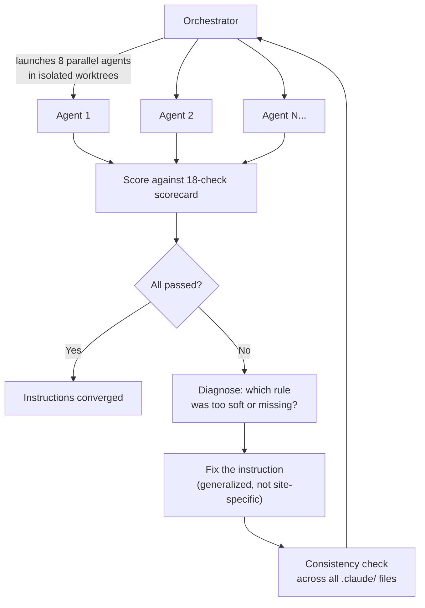
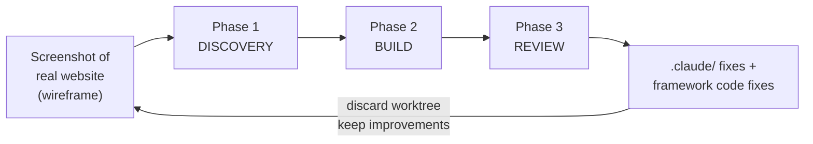

<h1 align="center">Interceptor</h1>

<p align="center">
  Turn any website into a typed JSON API — discovered by AI agents through browser traffic interception.
</p>

<p align="center">
  <a href="#the-self-improving-skill">Self-Improving Skill</a> &middot;
  <a href="#how-it-works">How It Works</a> &middot;
  <a href="#quick-start">Quick Start</a> &middot;
  <a href="#architecture">Architecture</a> &middot;
  <a href="#instruction-tuning">Instruction Tuning</a>
</p>

---

> [!WARNING]
> **Experimental Software — Use at Your Own Risk**
>
> This tool automates a real browser to intercept network traffic on third-party websites. Before using it against any target:
>
> - **Get explicit permission.** Intercepting traffic on sites you do not own or operate may violate their Terms of Service, the Computer Fraud and Abuse Act (CFAA), the GDPR, or equivalent laws in your jurisdiction. Only run this against sites you own, operate, or have written authorization to test.
> - **No scraping guarantees.** Bot-detection systems (Cloudflare, Akamai, Kasada, DataDome) may flag or block your IP. Some sites explicitly prohibit automated access. Check `robots.txt` and the site's ToS before proceeding.
> - **AI agent autonomy.** The discovery and instruction-tuning agents make autonomous decisions — navigating pages, clicking elements, extracting data, and writing code — based on natural-language rules. Their behavior is not fully deterministic and has not been validated against every possible target.
> - **Resource consumption.** Agents burn through API tokens (50K-170K per agent, 400K-1.3M for a parallel batch). Sub-agents can become detached zombie processes. Chrome instances can be orphaned. Run `bash .claude/hooks/cleanup-agents.sh` to clean up.
>
> **This is purely experimental research code.** The authors make no warranties, express or implied, regarding fitness for any particular purpose, correctness, or safety. The authors are not responsible for any consequences — legal, financial, technical, or otherwise — arising from the use or misuse of this software. Use it only in contexts where you have the legal right to do so.

---

## The Self-Improving Skill

The core innovation of this project is not the API interceptor — it's the **self-improving instruction set** that teaches AI agents how to use it.

The `.claude/` directory contains rules, skills, and agent definitions that Claude Code reads before performing any task. After every iteration of testing, these instructions are **automatically refined** based on what agents did wrong. The agents' code is throwaway. The instruction improvements are the product.

```
Iteration 1:  Rule says "you should capture traffic first"
              → Agent skips it, guesses the API instead
              → Fix: "MUST produce Transport Elimination table BEFORE code"

Iteration 15: Agents capture traffic but miss WebSocket transports
              → Fix: Add real-time transport checklist to PRE-FLIGHT step

Iteration 43: 7/8 sites complete, agents follow full protocol
              → 48+ routes across 8 sites, all tested through proxy

Iteration 44: Two-pass strategy doubles transport coverage (2.1 → 4.3 avg)
              → 70+ routes, new transports: Firebase WS, SSE, HLS, PubSub
```

Each iteration produces a batch of fresh agents that read ONLY the `.claude/` instructions — no hints, no coaching, no prior context. If they fail, the instructions are wrong. The loop runs until fresh agents consistently complete the full discovery protocol on any website.

This is [reflective programming](https://en.wikipedia.org/wiki/Reflective_programming) applied to AI agents — Claude Code examining, introspecting, and modifying its own instructions after every run.

## How It Works

Paste a URL. An AI agent connects a real browser, navigates the target site as a user, captures every network request via CDP, classifies each data transport (JSON, WebSocket, GraphQL, protobuf, embedded SSR, HLS, SSE), and generates typed proxy routes that return clean JSON. No API keys. No scraping guides. Just the real requests the browser makes.

```
$ curl localhost:3001/api/example/search?q=boards

{
  "results": [
    { "sku": "DECK-001", "name": "Street Destroyer 8.25", "price": 64.99 },
    { "sku": "DECK-002", "name": "Park Rider Pro 8.0", "price": 72.50 }
  ],
  "total": 847
}
```

### Two Systems

**API Discovery** turns websites into typed endpoints. **Instruction Tuning** iteratively improves the agent rules that drive discovery. A third system, **Dashboard Tuning**, uses the same self-improving loop to teach agents how to build Next.js dashboards from discovered APIs.

### API Discovery Protocol

The agent follows a mandatory 5-step protocol before writing any code:

1. **Pre-flight** — Write down everything you already know about the target (framework, APIs, pagination, auth, bot detection, real-time transports). Name specific pages with 100+ items.
2. **Gather** — Connect browser to homepage, browse naturally, navigate to data-heavy pages, intercept pagination traffic. Test discovered endpoints via browser fetch.
3. **Scan** — Fetch HTML + JS bundles. Scan for transport markers across all 8 categories. Check for access gaps (browser vs direct HTTP).
4. **Classify** — Fill the 8-row Transport Elimination table with evidence for every row. No exceptions.
5. **Build** — Create typed proxy routes for every transport found. Session harvest for auth-gated endpoints. Pagination until data is complete. Test every route through the API server proxy.

### Transport Types Discovered

| Transport | Example Sites | How Detected |
|---|---|---|
| Embedded JSON | Airbnb (`data-deferred-state`), TM (`__NEXT_DATA__`), YF (`data-sveltekit-fetched`) | HTML scan for framework markers |
| JSON API (XHR) | Reddit (`.json` suffix), YF (query1/query2 APIs) | Traffic capture + pagination params |
| GraphQL | Twitch (`gql.twitch.tv/gql`), Airbnb (v3 persisted queries) | Traffic + JS bundle scan |
| WebSocket | HN (Firebase real-time), Reddit (`gql-realtime`), Twitch (IRC + Hermes) | JS bundle scan for `wss://` URLs |
| HLS/Media | YouTube (live streams via googlevideo.com), Twitch (live + VOD) | Traffic + PlaybackAccessToken GQL |
| SSE | HN (Firebase REST with `Accept: text/event-stream`) | Direct endpoint testing |
| Encoded/Binary | YouTube (UMP protocol, DASH adaptive formats) | Traffic content-type analysis |
| RSS/XML | Reddit (`.rss`), HN (`/rss`), YouTube (`/feeds/videos.xml`) | Direct URL testing |

## Quick Start

```bash
pnpm install
pnpm dev                    # API on :3001, Web on :3000
```

Connect a browser and capture traffic:

```bash
./scripts/connect-browser.sh --profile example --url https://example.com
./scripts/capture-traffic.sh --summary
```

### Browser CLI

Token-efficient browser control for agents. Each command returns minimal, structured output.

```bash
./scripts/browser-cli.sh status                   # Check browser connection
./scripts/browser-cli.sh navigate <url>            # Navigate + snapshot
./scripts/browser-cli.sh snapshot                  # Accessibility tree
./scripts/browser-cli.sh screenshot                # Save screenshot
./scripts/browser-cli.sh click <selector>          # Click element
./scripts/browser-cli.sh traffic                   # Show captured traffic
./scripts/browser-cli.sh gather <url>              # Navigate + wait + snapshot + traffic
./scripts/browser-cli.sh interact <selector>       # Clear traffic, click, return new traffic
./scripts/browser-cli.sh paginate <selector> [max] # Click repeatedly, collect responses
```

### Test Server

Validate discovery against controlled fake sites before targeting real ones:

```bash
pnpm --filter @interceptor/test-server start   # Port 4444
```

| Test Site | Transport Pattern |
|---|---|
| `/boardshop` | Embedded JSON, POST pagination, CSRF, session harvest, encoded pricing, click-intercept |
| `/liveboard` | WebSocket + protobuf + crumb token |
| `/streamshop` | GraphQL + HLS + IRC WebSocket |
| `/databoard` | gRPC-Web + encoded responses + Bearer auth |

The `domains/boardshop/` plugin is the reference implementation with 33 routes covering every supported transport type.

## Architecture

```
interceptor/
├── apps/
│   ├── api/            Hono server — WebSocket, browser streaming, MCP endpoints, domain proxy
│   └── web/            Next.js dashboard
├── packages/
│   ├── browser/        Patchright automation + transport classifier
│   ├── shared/         Types, validation, debug logging
│   └── test-server/    Multi-transport fake sites for protocol validation
├── domains/            Generated domain plugins (ephemeral, per-branch)
├── scripts/
│   ├── browser-cli.sh  Token-efficient browser control CLI
│   ├── connect-browser.sh  Launch browser with CDP capture
│   └── ci-local.sh     Full CI checks
├── .claude/
│   ├── CLAUDE.md       Project instructions (every agent reads this)
│   ├── rules/          Process gates (discovery protocol, workflow, compliance)
│   ├── agents/         Agent identities (discovery, dashboard, reviewer)
│   ├── skills/         Self-improving skills (instruction-tuning, dashboard-tuning, etc.)
│   └── hooks/          Automation (worktree creation, cleanup, write guards)
└── services/
    └── python/         IPC bridge worker (NLP, matching, stats)
```

### Instruction Tuning Architecture



### Dashboard Tuning Architecture



Three-phase pipeline: discover the API, build a dashboard matching the website screenshot as a wireframe, then a SOTA reviewer agent does code review + UI design review. The reviewer's findings improve instructions and framework code. The dashboard is throwaway — only the improvements matter.

### Key Endpoints

| Endpoint | Purpose |
|---|---|
| `ws://localhost:3001/browser/stream` | CDP browser connection for traffic capture |
| `GET /browser/traffic` | Captured request/response entries |
| `POST /browser/mcp/navigate` | Navigate to URL, return accessibility snapshot |
| `POST /browser/mcp/click` | Click element by selector or text |
| `POST /browser/mcp/evaluate` | Run JavaScript in page context |
| `POST /browser/mcp/fetch` | Browser-authenticated fetch (forwards cookies) |
| `GET /api/<domain>/<path>` | Proxy through domain plugin routes |
| `GET /api` | List all registered domains and routes |

### The `.claude/` Directory

| File | Purpose | Self-Improves? |
|---|---|---|
| `CLAUDE.md` | Project-wide instructions every agent reads | Yes — tuning refines language |
| `rules/discovery.md` | 5-step discovery protocol with gates | Yes — primary tuning target |
| `rules/workflow.md` | Process cleanup, retry policy | Yes — infrastructure fixes |
| `agents/discovery-agent.md` | Discovery agent identity + budget | Yes — efficiency improvements |
| `agents/dashboard-agent.md` | Dashboard builder identity + budget | Yes — via dashboard tuning |
| `agents/reviewer-agent.md` | Read-only SOTA code + UI reviewer | Yes — review criteria evolve |
| `skills/instruction-tuning/` | Self-improvement loop for discovery | Meta — improves itself |
| `skills/instruction-dashboard-tuning/` | Self-improvement loop for dashboards | Meta — improves itself |
| `skills/api-discovery/` | Discovery skill with templates + references | Yes — patterns added |
| `skills/dashboard-builder/` | Dashboard build patterns + component library | Yes — via dashboard tuning |
| `skills/visual-dev/` | Screenshot + judge loop (7 criteria) | Yes — criteria refined |
| `hooks/cleanup-agents.sh` | Kill zombies, remove worktrees, revert files | Yes — port ranges expand |
| `hooks/guard-worktree-writes.sh` | Prevent agents from writing to main repo | Stable |
| `hooks/create-worktree.sh` | Isolated worktrees outside repo tree | Stable |

## Using the Skills

All skills are invoked from the Claude Code console with `/skill-name`. The skills handle setup, agent launching, monitoring, and cleanup automatically.

### Discovery Tuning — Improve the discovery protocol

```
/instruction-tuning
```

The skill will ask you 3 questions before launching:
1. **Passes** — 1 (breadth) or 2 (breadth + deep dive). Default: 1.
2. **Websites** — which sites to test (e.g., "reddit, youtube, twitch"). Max 8 per batch.
3. **Cleanup** — A (full cleanup), B (keep worktrees), C (keep agents alive), D (keep both).

Then it launches parallel discovery agents, monitors them live, scores results, and applies instruction fixes to `.claude/`.

### Dashboard Tuning — Improve the dashboard-building skills

```
/instruction-dashboard-tuning
```

Same 3 questions, plus a 3-phase pipeline: discover API, build dashboard matching a website screenshot as wireframe, then a reviewer agent does code + UI design review. Findings improve `.claude/` instructions and framework code.

### Build an App — Interactive API + dashboard builder

```
/app
```

Describe what you want in plain language (e.g., "compare ticket prices across sites"). The skill asks clarifying questions, explores the target sites with you, then builds domain plugins and a dashboard.

### Discover a Single API

```
/api-discovery
```

Point it at a website. It runs the full discovery protocol (PRE-FLIGHT, GATHER, SCAN, CLASSIFY, BUILD) and creates a domain plugin with typed proxy routes.

### Other Skills

| Command | Purpose |
| --- | --- |
| `/dashboard-builder` | Build a Next.js dashboard page against existing API routes |
| `/visual-dev` | Screenshot + judge loop for UI development |
| `/debug-logs` | Iterative debugging with targeted logs |
| `/systematic-testing` | Bottom-up validation of multi-layer systems |
| `/ci-check` | Run local CI checks before committing |
| `/ec2-deploy` | Deploy to EC2 production server |

## Tech Stack

TypeScript &middot; Hono &middot; Next.js &middot; Patchright &middot; Turborepo &middot; pnpm &middot; Vitest &middot; Biome &middot; Claude Code

## License

MIT
