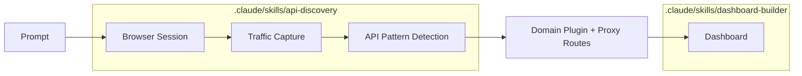

# Interceptor

Paste a natural-language prompt. Claude Code discovers the target site's API through browser traffic interception, generates a typed domain plugin with proxy routes, and builds a working dashboard — no manual work beyond the initial prompt.



The browser IS the API client. Patchright drives a real browser session, captures network traffic via CDP, and reverse-engineers API endpoints — no documentation required. Proxy routes then serve that data through the browser's authenticated session, so cookies and auth are automatic.

## Quick Start

```bash
pnpm install
pnpm dev          # API on :3001, Web on :3000
```

Give Claude Code a prompt like:

> Search StubHub for Bad Bunny events, get ticket prices, and build a dashboard comparing prices by section.

The skills handle domain scaffolding, API discovery, route creation, dashboard building, and visual verification.

## Structure

```
.claude/skills/       Skills that drive the whole process
  api-discovery/      Discover APIs, create domain plugins
  dashboard-builder/  Build Next.js pages from proxy APIs
  visual-dev/         Screenshot-based UI iteration
  debug-logs/         Runtime debugging with DEBUG()

domains/              Domain plugins (one per website)
packages/browser/     Patchright browser automation
packages/shared/      Types, validation, debug logging
apps/api/             Hono server with WebSocket + proxy routes
apps/web/             Next.js dashboard
```

## Key Endpoints

| Endpoint | Purpose |
|----------|---------|
| `GET /browser/health` | Browser connection status |
| `GET /browser/traffic` | Captured API traffic (CDP) |
| `GET /api` | List all domains and routes |
| `GET /api/<domain>/<path>` | Proxy through browser session |

## License

MIT
