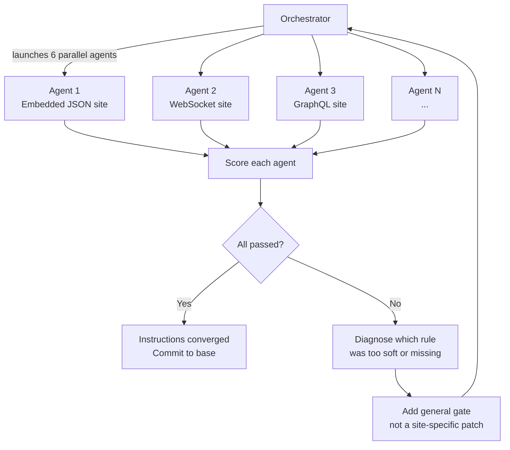
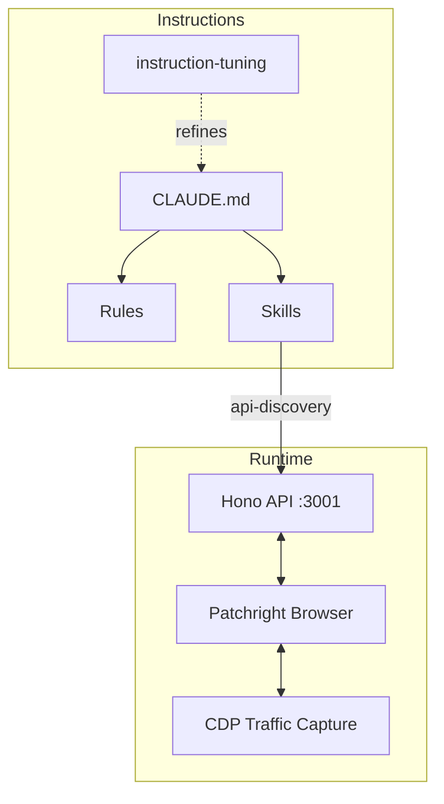

<h1 align="center">Interceptor</h1>

<p align="center">
  Turn any website into a typed JSON API — discovered by AI agents through browser traffic interception.
</p>

<p align="center">
  <a href="#how-it-works">How It Works</a> &middot;
  <a href="#quick-start">Quick Start</a> &middot;
  <a href="#instruction-tuning">Instruction Tuning</a> &middot;
  <a href="#architecture">Architecture</a>
</p>

---

Paste a natural-language prompt. An AI agent connects a real browser, navigates the target site as a user, captures every network request via CDP, classifies each data transport (JSON, WebSocket, GraphQL, protobuf, embedded SSR), and generates typed proxy routes that return clean JSON. No API keys. No scraping guides. Just the real requests the browser makes.

The agent handles the hard parts automatically: session harvest for auth-gated endpoints, click-intercept pagination that lets the browser manage cookies and CSRF, and encoded response decoding by tracing decoder functions in JS bundles.

```
$ curl localhost:3001/api/example/search?q=boards

{
  "results": [
    { "sku": "DECK-001", "name": "Street Destroyer 8.25", "price": 64.99 },
    { "sku": "DECK-002", "name": "Park Rider Pro 8.0", "price": 72.50 }
  ],
  "total": 847
}
```

## How It Works

Two systems work together: **API discovery** turns websites into typed endpoints, and **instruction tuning** iteratively improves the agent rules that drive discovery.

### API Discovery

The agent follows a mandatory protocol before writing any code:

1. **Connect** a browser via WebSocket with CDP traffic capture
2. **Gather** evidence — fetch HTML, JS bundles, and capture list + detail page traffic
3. **Scan** all sources for transport markers (embedded JSON, XHR, GraphQL, WebSocket, HLS, gRPC, SSE, encoded)
4. **Classify** — fill the 8-row Transport Elimination table with evidence for every row
5. **Identify access gaps** — compare browser responses vs. direct HTTP to find auth-gated endpoints
6. **Build** typed proxy routes for every transport found, with session harvest for auth-gated data and click-intercept pagination for multi-page results

Every transport type is marked present or absent with evidence. A route is built for every transport found, not just the first. Routes aren't done until they return complete, paginated data that matches what the page displays.

### Instruction Tuning

The `.claude/` directory is inspired by [reflective programming](https://en.wikipedia.org/wiki/Reflective_programming) — Claude Code examining, introspecting, and modifying its own instructions each iteration.

An orchestrator agent runs the tuning loop automatically. It launches sub-agents in clean, isolated worktrees with **no memory, no prior results, nothing but the `.claude/` rules**. Each sub-agent must complete a real discovery task using only the instructions it's given. If it takes a shortcut — using as search engine for API docs instead of capturing browser traffic, scraping the DOM instead of intercepting the JSON endpoint — the instructions allowed it. The sub-agent isn't broken. The rule is broken. The rule needs to be fixed.



The orchestrator scores every run against a checklist. Each failure traces to a specific instruction gap:

| Gate | Failure means... |
|---|---|
| Captured traffic before writing code? | Discovery gate language too soft — agent guessed instead of observing |
| Transport classification table produced? | Protocol was advisory, not mandatory — needs a structural gate |
| Network interception over DOM scraping? | Proof requirement missing — agent took the easy path |
| Found ALL data sources, not just the first? | "Don't stop early" was a suggestion — needs an interaction checkpoint |

**Concrete example:** An early rule said *"you should capture traffic first."* Agents skipped it. The fix: *"GATE: you MUST produce a Transport Elimination table BEFORE writing any extraction code. No table = no code."* The word choice is the fix — "should" became "MUST," and a structural gate replaced a suggestion. The loop runs until a batch of fresh agents, with zero context, all follow the full protocol without shortcuts. That's the convergence condition — instructions good enough to work on their own.

## Quick Start

```bash
pnpm install
pnpm dev                    # API on :3001, Web on :3000
```

Connect a browser and capture traffic:

```bash
./scripts/connect-browser.sh --profile example --url https://example.com
./scripts/capture-traffic.sh --summary
```

### Browser CLI

Token-efficient browser control for agents. Each command returns minimal, structured output — no HTML dumps or verbose JSON.

```bash
./scripts/browser-cli.sh status                   # Check browser connection
./scripts/browser-cli.sh navigate <url>            # Navigate + snapshot
./scripts/browser-cli.sh snapshot                  # Accessibility tree
./scripts/browser-cli.sh screenshot                # Save screenshot
./scripts/browser-cli.sh click <selector>          # Click element
./scripts/browser-cli.sh traffic                   # Show captured traffic
./scripts/browser-cli.sh gather <url>              # Navigate + wait + snapshot + traffic
./scripts/browser-cli.sh interact <selector>       # Clear traffic, click, return new traffic
./scripts/browser-cli.sh paginate <selector> [max] # Click repeatedly, collect responses
```

The CLI wraps the `/browser/mcp/*` REST endpoints, which can also be called directly for programmatic access.

### Test Server

Validate the discovery protocol against controlled fake sites before targeting real ones:

```bash
pnpm --filter @interceptor/test-server start   # Port 4444
```

| Test Site | Transport Pattern |
|---|---|
| `/boardshop` | Embedded JSON, POST pagination, CSRF, session harvest, encoded pricing, click-intercept |
| `/liveboard` | WebSocket + protobuf + crumb token |
| `/streamshop` | GraphQL + HLS + IRC WebSocket |
| `/databoard` | gRPC-Web + encoded responses + Bearer auth |

The `domains/boardshop/` plugin serves as the reference implementation with 33 routes covering every supported transport type — from basic embedded JSON to session harvest with cookie elimination and click-intercept pagination.

## Architecture

```
interceptor/
├── apps/
│   ├── api/            Hono server — WebSocket, browser streaming, MCP endpoints, domain proxy
│   └── web/            Next.js dashboard
├── packages/
│   ├── browser/        Patchright automation + transport classifier
│   ├── shared/         Types, validation, debug logging
│   └── test-server/    Multi-transport fake sites for protocol validation
├── domains/            Generated domain plugins (ephemeral, per-branch)
├── scripts/
│   ├── browser-cli.sh  Token-efficient browser control CLI
│   ├── connect-browser.sh  Launch browser with CDP capture
│   └── ci-local.sh     Full CI checks
├── .claude/
│   ├── CLAUDE.md       Agent mission, rules, constraints
│   ├── rules/          Process gates (discovery, compliance, workflow)
│   └── skills/         Reusable agent capabilities
└── services/
    └── python/         IPC bridge worker
```



| Endpoint | Purpose |
|---|---|
| `ws://localhost:3001/browser/stream` | CDP browser connection for traffic capture |
| `GET /browser/traffic` | Captured request/response entries |
| `GET /browser/mcp/status` | Browser connection status |
| `POST /browser/mcp/navigate` | Navigate to URL, return accessibility snapshot |
| `GET /browser/mcp/snapshot` | Current page accessibility tree |
| `POST /browser/mcp/click` | Click element by selector or text |
| `POST /browser/mcp/evaluate` | Run JavaScript in page context |
| `GET /api/<domain>/<path>` | Proxy through domain plugin routes |
| `GET /api` | List all registered domains and routes |

## Tech Stack

TypeScript &middot; Hono &middot; Next.js &middot; Patchright &middot; Turborepo &middot; pnpm &middot; Vitest &middot; Biome

## License

MIT
