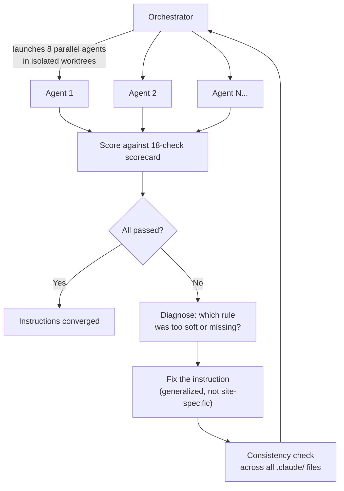

<h1 align="center">Interceptor</h1>

<p align="center">
  Turn any website into a typed JSON API — using Claude Code with self improving agents.
</p>

---

> [!WARNING]
> **Experimental Software — Use at Your Own Risk**
>
> This tool automates a real browser to intercept network traffic on third-party websites. Before using it against any target:
>
> - **Get explicit permission.** Intercepting traffic on sites you do not own or operate may violate their Terms of Service, the Computer Fraud and Abuse Act (CFAA), the GDPR, or equivalent laws in your jurisdiction. Only run this against sites you own, operate, or have written authorization to test.
> - **No scraping guarantees.** Bot-detection systems (Cloudflare, Akamai, Kasada, DataDome) may flag or block your IP. Some sites explicitly prohibit automated access. Check `robots.txt` and the site's ToS before proceeding.
> - **AI agent autonomy.** The discovery and instruction-tuning agents make autonomous decisions — navigating pages, clicking elements, extracting data, and writing code — based on natural-language rules. Their behavior is not fully deterministic and has not been validated against every possible target.
> - **Resource consumption.** Agents burn through API tokens (50K-170K per agent, 400K-1.3M for a parallel batch). Sub-agents can become detached zombie processes. Chrome instances can be orphaned. Run `bash .claude/hooks/cleanup-agents.sh` to clean up.
>
> **This is purely experimental research code.** The authors make no warranties, express or implied, regarding fitness for any particular purpose, correctness, or safety. The authors are not responsible for any consequences — legal, financial, technical, or otherwise — arising from the use or misuse of this software. Use it only in contexts where you have the legal right to do so.

---

## Prerequisites

- [Node.js](https://nodejs.org/) v20+
- [pnpm](https://pnpm.io/) v10+
- [Claude Code](https://docs.anthropic.com/en/docs/claude-code) installed and authenticated

## Getting Started

```bash
git clone https://github.com/adam-s/intercept.git
cd intercept
claude
```

That's it. Claude Code reads the `.claude/` directory automatically — it contains all the rules, skills, and agent definitions that drive the system. It handles installing dependencies, starting services, and everything else. Just tell it what you want.

### Discover a website's API

Tell Claude what site you want:

```text
> Discover the API for Hacker News
```

Or use the slash command directly:

```text
> /api-discovery https://news.ycombinator.com
```

Claude will:

1. Connect a browser to the site
2. Navigate pages and capture network traffic
3. Classify every data transport (JSON, WebSocket, GraphQL, SSE, etc.)
4. Build typed proxy routes that return clean JSON
5. Test every route through the API server

When it's done, you can curl your new API:

```bash
curl localhost:3001/api/hackernews/top?page=1&limit=5
curl localhost:3001/api/hackernews/search?query=rust
curl localhost:3001/api/hackernews/story/12345
```

### Build a dashboard

Once routes exist, ask Claude to build a frontend:

```text
> /dashboard-builder
```

Or just describe what you want:

```text
> Build a dashboard page for Hacker News with search, story list, and comments
```

Claude builds a Next.js page at `apps/web/app/<domain>/page.tsx` that calls your proxy routes.

### Build an entire app from a description

```text
> /app
```

Describe what you want in plain language ("compare ticket prices across sites", "track HN trends over time"). Claude asks clarifying questions, discovers the APIs, and builds the dashboard.

## Slash Commands

Type `/` in Claude Code to see available commands:

| Command | What it does |
| --- | --- |
| `/api-discovery` | Discover a website's API and create proxy routes |
| `/dashboard-builder` | Build a Next.js page for existing routes |
| `/app` | Build a complete app from a plain-language description |
| `/visual-dev` | Screenshot-driven UI iteration |
| `/debug-logs` | Iterative debugging with targeted logs |
| `/ci-check` | Run lint, build, typecheck, and tests |
| `/instruction-tuning` | Improve the discovery instructions by testing agents on real sites |
| `/instruction-dashboard-tuning` | Improve dashboard-building instructions the same way |
| `/ec2-deploy` | Deploy to production |

## How It Works

Claude Code reads the `.claude/` directory on startup. That directory contains:

- **Rules** — mandatory protocols the agent follows (discovery steps, workflow gates, compliance checks)
- **Skills** — slash commands that orchestrate multi-step tasks
- **Agents** — specialized sub-agent identities (discovery, dashboard, reviewer)
- **Hooks** — shell scripts that run on events (cleanup, worktree isolation, write guards)

When you ask Claude to discover a site's API, it follows a 5-step protocol: pre-flight analysis, browser traffic gathering, HTML/JS scanning, transport classification, and route building. The protocol was refined over 47+ iterations of self-improving instruction tuning — agents testing the instructions, failing, and the instructions being fixed until fresh agents consistently succeed.

The generated domain plugins live in `domains/<name>/` and expose routes through the Hono API server at `localhost:3001/api/<domain>/<path>`.

## The Self-Improving Skill

The `.claude/` instructions aren't static — they're the product of iterative refinement. The `/instruction-tuning` skill launches parallel agents against real websites, scores their results, diagnoses failures, and fixes the instructions. The agents' code is throwaway. The instruction improvements are the product.



```text
Iteration 1:  "you should capture traffic first" → agent skips it
              → Fix: "MUST produce elimination table BEFORE code"

Iteration 15: Agents miss WebSocket transports
              → Fix: Add real-time transport checklist to pre-flight

Iteration 44: Two-pass strategy doubles transport coverage (2.1 → 4.3 avg)
              → 70+ routes, new transports: WS, SSE, HLS, PubSub
```

## Tech Stack

TypeScript · Hono · Next.js · Patchright · Turborepo · pnpm · Vitest · Biome · Claude Code

## License

MIT
