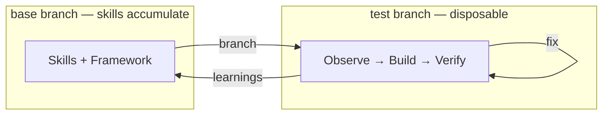
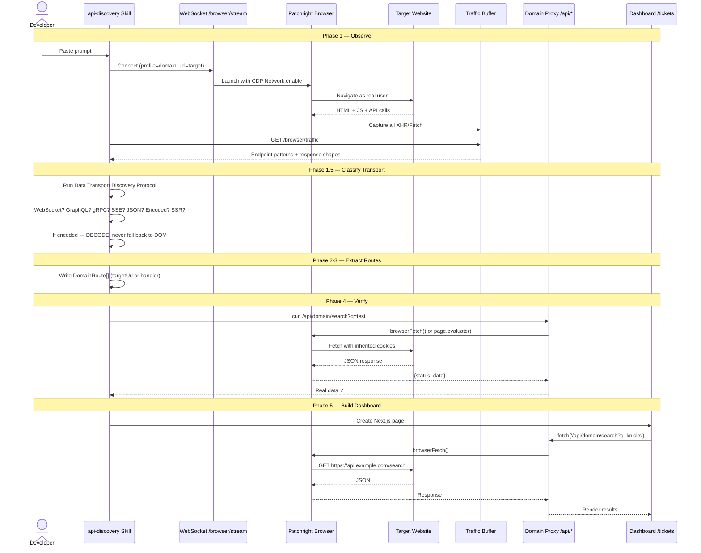
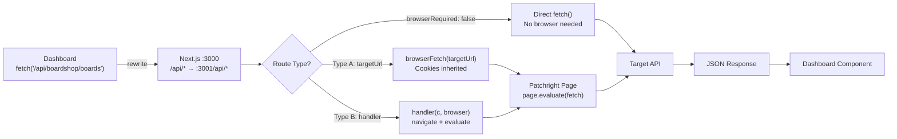

# Interceptor

Paste a natural-language prompt. Claude Code discovers the target site's API through browser traffic interception, generates a typed domain plugin with proxy routes, and builds a working dashboard — no manual work beyond the initial prompt.

The browser IS the API client. Patchright drives a real browser session, captures network traffic via CDP, and reverse-engineers API endpoints — no documentation required. Proxy routes then serve that data through the browser's authenticated session, so cookies and auth are automatic.

## How It Works



The outer loop improves the skills. The inner loop builds each app. Every test branch is disposable — only the skills grow.

## Architecture



## Data Transport Discovery

**The most important capability in the project.** Before writing any route, the agent must classify how the target site serves each data type. The full protocol is at `.claude/rules/data-transport-discovery.md`.

```
Priority order — check in this exact sequence:
  (a) WebSocket frames?         → intercept WS
  (b) GraphQL requests?         → proxy GraphQL query
  (c) gRPC-Web?                 → decode protobuf, proxy RPC
  (d) Server-Sent Events?       → relay event stream
  (e) XHR/Fetch JSON?           → Type A proxy (browserFetch)
  (f) Encoded XHR (non-JSON)?   → ⚠️  DECODE IT — never skip to DOM
  (g) Zero network requests?    → SSR (last resort, must prove a-f empty)
```

**The golden rule:** If ANY network request carries the data — even encoded, even obfuscated — the route MUST intercept it. DOM extraction is the absolute last resort.

The framework includes:
- **`classifyTransport()`** utility in `packages/browser/` — automates this decision tree on captured traffic
- **`packages/test-server/`** — serves canonical data via all 12 transport types for development and testing
- **Site transport audit** at `docs/testing/site-transport-audit.md` — researched classifications for all websites in `prompts/`

## Proxy Request Flow



## Quick Start

```bash
pnpm install
pnpm dev          # API on :3001, Web on :3000
```

Give Claude Code a prompt like:

> Search both BoardShop and DeckMarket for Element 8.0" decks. Match listings across platforms by brand, size, and colorway. Build a dashboard that shows a side-by-side price comparison — rows are products, columns are platforms, cheapest option highlighted in green.

The skills handle domain scaffolding, API discovery, route creation, dashboard building, and visual verification.

### Test Server

```bash
pnpm --filter @interceptor/test-server start   # Port 4444
curl http://localhost:4444/                      # List all transport endpoints
curl http://localhost:4444/api/json/performers?q=taylor   # JSON
curl http://localhost:4444/graphql -X POST -d '{"query":"{ performers(query: \"taylor\") { name } }"}'  # GraphQL
curl http://localhost:4444/ssr/search?q=taylor   # SSR HTML
```

## Structure

```
.claude/
  CLAUDE.md               Agent instructions (loaded every session)
  rules/                  Process rules (loaded automatically)
    data-transport-discovery.md   THE core rule — transport classification protocol
    inspection-first.md           Observe before guessing
    prompt-compliance.md          Compliance matrix before every commit
    base-branch.md                Base accumulates learning
    workflow.md                   Verification, git hygiene
    iteration-loop.md             Autonomous mode, build loop
  skills/                 Skills that drive the whole process
    api-discovery/        Discover APIs, create domain plugins
    dashboard-builder/    Build Next.js pages from proxy APIs
    visual-dev/           Screenshot-based UI iteration
    debug-logs/           Runtime debugging with DEBUG()

prompts/                  Natural-language prompts (one per domain iteration)
docs/
  testing/
    site-transport-audit.md   Researched transport types for all prompt websites

domains/                  Domain plugins (one per website)
packages/
  browser/                Patchright browser automation + transport classifier
  shared/                 Types, validation, debug logging
  test-server/            Multi-transport test server (12 transport types)
apps/
  api/                    Hono server with WebSocket + proxy routes
  web/                    Next.js dashboard
services/
  python/                 Python worker for IPC bridge
```

## Key Endpoints

| Endpoint | Purpose |
|----------|---------|
| `GET /health` | Server health |
| `GET /browser/health` | Browser connection status |
| `GET /browser/traffic` | Captured API traffic (CDP, WS browser only) |
| `GET /api` | List all domains and routes |
| `GET /api/<domain>/<path>` | Proxy through browser session |

## Test Server Transports

The test server at `packages/test-server/` serves identical canonical data (5 events, 3 performers) via every transport type, enabling development and testing of the capture + classification pipeline without external sites.

| Priority | Transport | Test Endpoint |
|----------|-----------|--------------|
| (a) | WebSocket | `WS /ws/prices` |
| (b) | GraphQL | `POST /graphql` |
| (b) | GraphQL Persisted | `POST /api/v3/:op/:hash` |
| (c) | gRPC-Web | `POST /grpc/testserver.EventService/*` |
| (d) | SSE | `GET /sse/prices` |
| (e) | JSON API | `GET /api/json/*` |
| (e) | JSON + Crumb Auth | `GET /api/crumb/*` |
| (f) | Base64 Encoded | `GET /api/encoded/b64/*` |
| (f) | Protobuf | `GET /api/encoded/proto/*` |
| (f) | MessagePack | `GET /api/encoded/msgpack/*` |
| (g) | Pure SSR | `GET /ssr/*` |
| (g) | Hybrid SSR | `GET /hybrid/*` |

## Autonomous Mode Setup

If using Claude Code autonomously (no human reviewing each step), add the prompt compliance gate to your project memory so it loads into every conversation:

1. Create `feedback_prompt_compliance.md` in your Claude Code memory directory:

```markdown
---
name: prompt_compliance_gate
description: Before committing, list every prompt requirement with evidence. Any without evidence = not done.
type: feedback
---

Before committing: list every prompt requirement, state evidence for each (curl output, screenshot,
Patchright click). Any requirement without evidence = not done. Loop until all have evidence.

**Why:** An agent can build something that looks correct in screenshots but silently misses half the
prompt's requirements. Visual QA verifies quality; the compliance matrix verifies completeness.

**How to apply:** At the start of work, extract requirements from the prompt into a numbered list.
Before committing, produce a Prompt Compliance Matrix with PASS/FAIL and evidence for each row.
```

2. Add a pointer in your `MEMORY.md`:

```
- [Prompt compliance gate](feedback_prompt_compliance.md) — BEFORE COMMITTING: list every prompt requirement, state evidence for each. Any without evidence = not done.
```

This is a third layer of enforcement (alongside CLAUDE.md and skill files) ensuring the agent verifies completeness before committing.

## License

MIT
