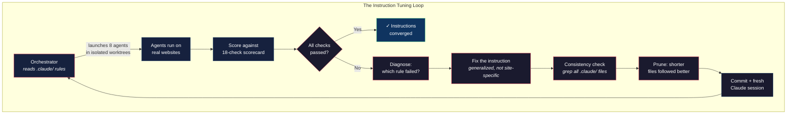

# Forty-Six Iterations

I launched eight AI agents on real websites and told them to discover every API transport — JSON, WebSocket, GraphQL, protobuf, all of it. They had 150 tool calls each, a headless browser, and a 315-line instruction file I'd spent a week writing.

Seven of them found one transport and stopped.

---

The instruction file was a decision tree. "If you see embedded JSON, extract it. If the page uses XHR, capture the endpoint. If you find a WebSocket URL..." Branches upon branches. An agent would navigate to a page, spot a `__NEXT_DATA__` script tag, take the embedded JSON branch, build one route, and declare victory. The other seven transports — WebSocket, GraphQL, HLS, SSE, gRPC — never even got checked.

I read the instruction file again. The tree was correct. Every branch led to a valid action. The problem wasn't the logic. The problem was the shape. A branching structure invites early exits. The first match becomes the only match.

```
# What agents saw:
if embedded_json → extract → done ✓
if xhr_api → capture → done ✓
if graphql → introspect → done ✓
```

The word "if" was the bug. "If" means "this is one possible path." An agent optimizing for task completion picks the first successful path and moves on. Why keep looking when you've found something that works?

---

I deleted the decision tree and wrote a linear pipeline. Four steps, no branches.


GATHER connects a browser and captures traffic. SCAN greps HTML, JS bundles, and traffic for markers across all eight transport categories. CLASSIFY fills an elimination table — every transport gets a row, every row gets ✓ or ✗ with evidence. BUILD creates a route for every ✓.

The key constraint: you cannot start BUILD until every row in the elimination table is filled. No early exits. No "found JSON so skip WebSocket." The pipeline forces breadth before depth.

```
## Transport Elimination Table
| Transport      | Present? | Evidence                    |
|----------------|----------|-----------------------------|
| Embedded JSON  | ✓        | __NEXT_DATA__ on /events    |
| JSON API (XHR) | ✓        | POST /api/search?page=1     |
| GraphQL        | ✗        | No /graphql in traffic or JS|
| WebSocket      | ✓        | wss://stream.example.com    |
| HLS/Media      | ✗        | No .m3u8 in traffic         |
| gRPC-Web       | ✗        | No application/grpc         |
| SSE            | ✗        | No EventSource in JS        |
| Encoded/Binary | ✗        | No protobuf markers         |
```

That table became mandatory. Not "fill it if you have time." Not "check for these if possible." Mandatory. The gate was explicit: no code until all eight rows have evidence.

---

The first iteration with the pipeline discovered three transports per site instead of one. The second iteration discovered four. By iteration 44, agents were averaging 4.3 transports per site and building 70+ routes across eight parallel tests.

But the pipeline was only the first fix. Over 46 iterations, I made 34 instruction changes — and each one revealed something about how AI agents read and follow rules that I didn't expect.



Each iteration: launch fresh agents (no hints, no coaching, no memory of previous runs), watch them work, score against an 18-check scorecard, diagnose the instruction gap, fix it, verify consistency across every file, prune, commit, start a fresh session to clear stale context.

The agents' code is throwaway. The instruction improvements are the product.

I didn't expect it to take 46 iterations. But the gap between "an agent that reads instructions" and "an agent that reliably follows a complex protocol" turned out to be enormous — and the failures were never where I thought they'd be.
