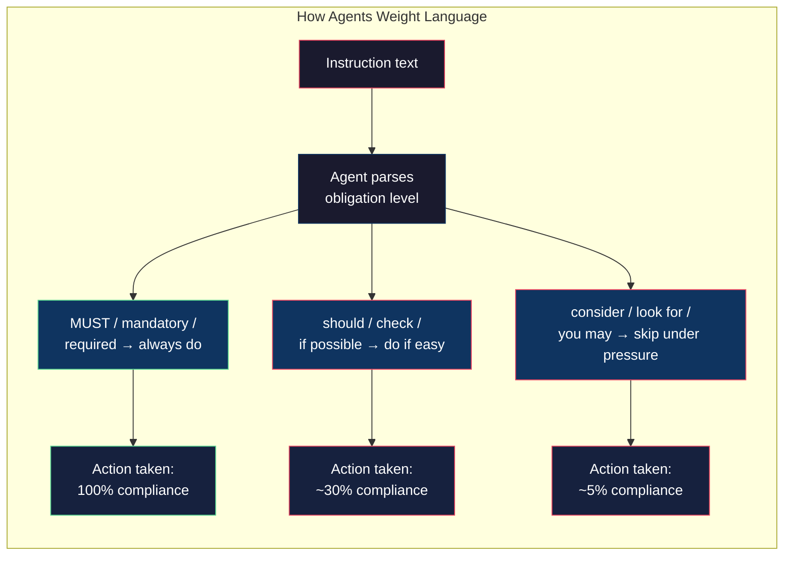

# The Word "Should"

Eight agents. Eight websites. The instruction file said agents "should check for pagination" and "should attempt session harvest for protected endpoints." Every agent read the file. Not one of them paginated. Not one harvested a session.

They built routes that returned 20 items out of 847. They hit auth-gated endpoints, got 403s, and moved on to the next transport. The scorecard lit up red across the board.

---

I audited the instruction file and found eight soft phrases. Not in obscure corners — in the critical path. The pagination rule read: "check for pagination parameters." The session harvest rule: "if possible, attempt to extract session tokens."

"Check for" is not "do." "If possible" is an escape hatch. An agent under a 150-call budget, facing an auth wall that might take 20 calls to crack, reads "if possible" as permission to skip. And it's right to — the instruction literally said it was optional.

Here's what I changed:

```
Before: "Check for pagination and test each route"
After:  "MUST produce completeness check: items returned vs total indicated"

Before: "If the endpoint requires auth, attempt session harvest"
After:  "Gap=Y endpoints go directly to session harvest. This IS
         the correct approach, not a fallback"

Before: "Test each route through the proxy"
After:  "Route must return real data — not empty arrays, not error
         objects, not HTML. Completeness verified"
```

The word "should" became "MUST." The phrase "if possible" became "IS the correct approach." The vague success criteria "test each route" became a concrete artifact: "items returned vs total indicated."

---

This is the mechanism that surprised me. An AI agent doesn't ignore soft language the way a human might — skimming past a "should" because you're in a hurry. The agent reads every word. It just weighs them.

"Should" gets a lower priority than "MUST." "If possible" gets deprioritized when resources are constrained. "Check for" becomes a read-only observation instead of an action. The agent isn't being lazy. It's making reasonable decisions based on the weight of the language.



I went through the entire instruction set and hardened every obligation. Not just the word — the shape. A soft rule says what to look for. A hard rule defines a mandatory artifact.

```
Soft:  "Test each route through the API proxy"
Hard:  "After each route, fill:
        | Items returned  | ___ |
        | Total indicated | ___ |
        | Complete        | yes / no |
        If total > items returned, paginate"
```

The artifact is the trick. An agent can skip a vague instruction without any visible consequence — there's no missing deliverable. But a mandatory table with blank cells is an incomplete task. The agent can see it's not done.

---

The next iteration, every agent paginated. Every agent attempted session harvest on auth-gated endpoints. Two of them still failed (the auth was genuinely complex), but they failed at the attempt, not at the decision to try. The language changed. The behavior changed.

I started tracking a new metric: how many instructions use obligation language ("MUST," "mandatory," "required," "IS the approach") versus hedging language ("should," "consider," "if possible," "check for"). In the first version of `discovery.md`, the ratio was roughly 1:1. By iteration 46, every critical-path instruction uses obligation language. The hedging survived only in genuinely optional guidance — "you may use `page.evaluate` for quick DOM checks" — where skipping truly has no consequence.
