# The Model Already Knew

I watched an agent spend 23 tool calls discovering that a major e-commerce site uses Next.js. It connected a browser, navigated to the homepage, fetched the HTML, found a `__NEXT_DATA__` script tag, and wrote: "This site appears to be built with Next.js."

The model was trained on the internet. It already knew that. It knew the framework, the API patterns, the pagination style, which pages have thousands of items, and which endpoints require authentication. All of that was in the weights before the browser even launched.

But the instructions said "GATHER: connect browser and explore the target site." So it explored. From scratch. Every time.

---

Twenty-three calls on framework identification. Another fifteen navigating to the wrong pages — a category with 12 items instead of 1,200. Then running out of budget before building half the routes, because GATHER consumed 40% of the 150-call allocation on things the model already knew.

The fix was obvious once I saw it. I added a Step 0: PRE-FLIGHT.

Before connecting the browser, write down everything you already know about this website. Framework. API patterns. Pagination. Auth. Bot detection. Which pages will have the most items. Name the specific navigation path — not "a popular category" but the actual page you'd go to.

```mermaid
graph TD
    subgraph "Before PRE-FLIGHT"
        B1["Connect browser"] --> B2["Navigate homepage"]
        B2 --> B3["Explore categories<br/><i>12 items — wrong page</i>"]
        B3 --> B4["Try another category<br/><i>8 items — still wrong</i>"]
        B4 --> B5["Find busy page<br/><i>finally: 200+ items</i>"]
        B5 --> B6["Discover framework<br/><i>already knew this</i>"]
        B6 --> B7["~40 calls spent<br/>on orientation"]
    end

    subgraph "After PRE-FLIGHT"
        A0["Write pre-flight:<br/>Next.js, XHR API at /api/search,<br/>paginated by ?page=N,<br/>busiest page: /shoes/running"] --> A1["Connect browser"]
        A1 --> A2["Navigate directly to<br/>/shoes/running"]
        A2 --> A3["Confirm: 1,200 items ✓<br/>?page=1 in traffic ✓"]
        A3 --> A4["~8 calls spent<br/>on orientation"]
    end

    style B1 fill:#1a1a2e,stroke:#e94560,color:#fff
    style B2 fill:#1a1a2e,stroke:#e94560,color:#fff
    style B3 fill:#1a1a2e,stroke:#e94560,color:#fff
    style B4 fill:#1a1a2e,stroke:#e94560,color:#fff
    style B5 fill:#1a1a2e,stroke:#e94560,color:#fff
    style B6 fill:#1a1a2e,stroke:#e94560,color:#fff
    style B7 fill:#1a1a2e,stroke:#e94560,color:#fff
    style A0 fill:#0f3460,stroke:#53cf8d,color:#fff
    style A1 fill:#16213e,stroke:#53cf8d,color:#fff
    style A2 fill:#16213e,stroke:#53cf8d,color:#fff
    style A3 fill:#16213e,stroke:#53cf8d,color:#fff
    style A4 fill:#16213e,stroke:#53cf8d,color:#fff
```



The pre-flight template looks like this:

```
## Pre-flight: [target URL]
- What is this site? What does it sell/show?
- Framework: [Next.js, SvelteKit, React SPA, etc.]
- Known API patterns: [internal API paths, GraphQL, REST]
- Pagination: [cursor, offset/limit, page numbers, infinite scroll]
- Authentication: [public, API key, CSRF, cookies, OAuth]
- Bot detection: [Cloudflare, Kasada, Akamai, none known]
- Embedded data: [__NEXT_DATA__, data-deferred-state, etc.]
- Real-time: [WebSocket URLs, SSE, live feeds]
```

And the hierarchy exercise, which forces the agent to plan its navigation:

```
Level 1: [top-level browsing] → pick the busiest category
Level 2: [mid-level listing] → pick the most popular item
Level 3: [detail page] → THIS is where pagination lives
```

---

There was a trap, though. The first agents that used PRE-FLIGHT trusted it too much. They'd write down "no WebSocket on this site" based on training data and never check. The training data was stale for some sites — features had been added since the knowledge cutoff.

So I added a warning:

> **Your training data may be stale.** Everything above is a hypothesis. GATHER must confirm or correct every assumption. Do NOT skip GATHER or build routes from pre-flight knowledge alone.

PRE-FLIGHT is a hypothesis. GATHER is the experiment. The agent navigates to the page it predicted would be busy, confirms or corrects the prediction, and burns 8-12 calls instead of 40 on orientation. The remaining calls go to actual route building.

---

The budget shift was dramatic. Before PRE-FLIGHT, the average breakdown was:

```
GATHER: ~40 calls (orientation + wrong pages + rediscovery)
SCAN:    ~8 calls
CLASSIFY: ~2 calls
BUILD:  ~80 calls
Testing: ~20 calls
```

After:

```
PRE-FLIGHT: 0 calls (reasoning only)
GATHER: ~15 calls (confirmation + pagination capture)
SCAN:    ~8 calls
CLASSIFY: ~2 calls
BUILD:  ~95 calls
Testing: ~30 calls
```

Same 150-call budget. Forty more calls for building and testing. The model knew where to look — it just needed permission to say so before opening the browser.
