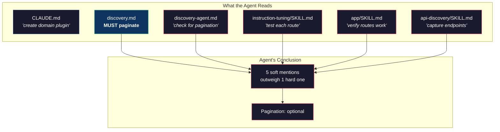

# One Soft Word

I hardened the pagination rule in `discovery.md`. Changed "check for pagination" to "MUST produce completeness check." Committed it. Launched eight agents. Two of them still skipped pagination.

I read their logs. Both agents had followed the pipeline correctly — GATHER, SCAN, CLASSIFY, BUILD. Both filled the elimination table. Both found XHR endpoints with pagination params. And both built routes that returned 20 items out of 400+, declared them working, and moved on.

The instruction was clear. I'd just fixed it. What happened?

---

I grepped.

```bash
grep -rn "pagina" .claude/rules/ .claude/agents/ .claude/skills/
```

The pagination concept appeared in six files. `discovery.md` now said MUST. But `discovery-agent.md` — the file that defines the agent's identity and is loaded into every sub-agent's context — still said "check for pagination." The agent skill template in `instruction-tuning/SKILL.md` said "test each route." The app builder skill said "verify routes work."

Six files. One hard rule. Five soft ones. The agent reads all of them. When `discovery.md` says MUST but `discovery-agent.md` says "check for," which wins?

Neither. The agent does what most of the text implies. And most of the text implied pagination was optional.

---

This is the consistency problem in multi-file instruction systems. When the same concept lives in multiple places, changing one file is meaningless. The agents don't read one file — they read all of them. The instruction set is the union of every `.claude/` file in context, and a single soft mention anywhere undermines a hard gate everywhere else.



I added a mandatory step to the tuning loop: the consistency check.

Before committing any instruction change, search every `.claude/` file for the concept you changed. If you tightened pagination language, grep for "pagina" across all rules, agents, and skills. Every hit must use the same obligation level.

```bash
# After changing pagination language:
grep -rn "pagina\|totalCount\|hasMore\|complete" \
  .claude/rules/ .claude/agents/ .claude/skills/
```

The files to check:
- `rules/discovery.md` — the protocol
- `agents/discovery-agent.md` — agent identity
- `skills/instruction-tuning/SKILL.md` — tuning scorecard
- `skills/api-discovery/SKILL.md` — discovery entry point
- `skills/app/SKILL.md` — app builder that launches discovery
- `CLAUDE.md` — project-wide instructions

A single soft "check for" in any file undoes a hard "MUST" in another. This is the rule I keep coming back to. It's the most counterintuitive thing about writing instructions for AI agents: fixing one file can make things worse by creating an inconsistency that didn't exist before.

---

After adding the consistency check, the next iteration had zero pagination skips. Not because the agents suddenly understood pagination better — but because every file they read agreed on what to do about it.

The lesson generalized. Every instruction change I made after that went through the same process: change the rule, grep for the concept, update every file, verify they all say the same thing. It added five minutes to every commit. It eliminated an entire class of failures.
