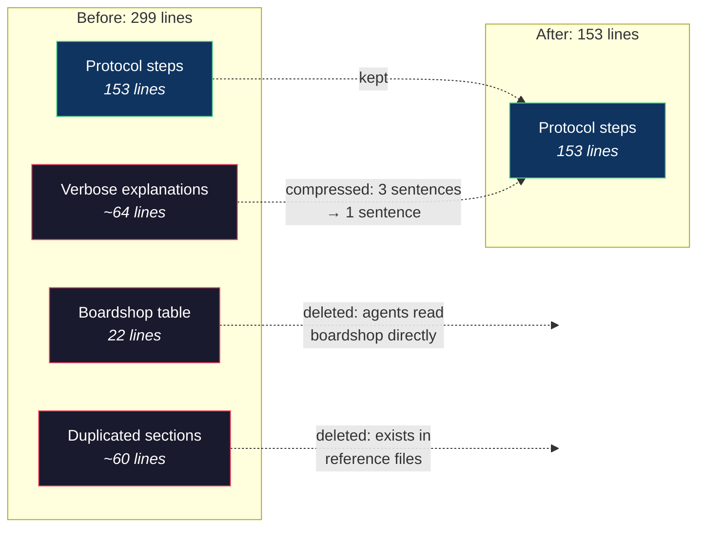

# 299 Lines to 153

The discovery protocol was 299 lines long. It had a 22-row reference table showing every route in the boardshop test domain. A click-intercept pagination section that duplicated what was already in `session-harvest.md`. A Token Catalog that repeated the SCAN step. Verbose explanations. Repeated phrasing. Hedging.

Agents read the whole thing. They also forgot half of it.

---

The 22-row boardshop table was there because agents kept asking "what does a working route look like?" So I'd added concrete examples. Route name, URL pattern, transport type, pagination method — all 22 of them, in the protocol file that every agent reads before doing anything.

The table was correct. But it was also 22 lines of information about one specific domain, embedded in a general-purpose protocol. The agents would read the table, internalize the boardshop patterns, and then go look for those exact patterns on completely different websites. They'd try to find `__NEXT_DATA__` on sites that don't use Next.js, because the boardshop used it and the table was fresh in context.

The table wasn't teaching a protocol. It was teaching a specific website.

---

I deleted it. And the click-intercept section — agents could read the reference file directly if they needed it. And the Token Catalog — redundant with SCAN. And every sentence that said the same thing twice in different words.

```
Before:
"When you encounter traffic entries, you should examine the response
 headers carefully to identify the content-type, which will help you
 determine what kind of transport is being used for this particular
 endpoint."

After:
"Check response content-type in traffic entries."
```

One sentence instead of three. Same information. Less context consumed.



---

The results were immediate. Agents on the pruned instructions followed the pipeline more reliably than agents on the verbose version. Not because the instructions were better — they were the same instructions, minus the noise. But shorter files have a higher signal-to-noise ratio. Every line that survived the prune was load-bearing. Every line was a rule the agent needed to follow.

In a 299-line file, the critical gate — "fill ALL 8 elimination rows before writing code" — was one line among hundreds. In a 153-line file, it's one line among dozens. The ratio changed. The weight changed.

---

I started applying this aggressively. The agent identity file went from 95 lines to 55. The tuning skill lost its verbose examples. Every file got the same question: "If I delete this line, will the agent do something wrong?" If the answer was "no, because the information exists in another file" or "no, because it's obvious" — the line was gone.

This ran counter to my instinct. When agents fail, the natural response is to add more instructions. Explain more. Add examples. Add warnings. But more text means more noise, more competing signals, more context for the agent to weigh against the rules that actually matter.

The pruning rule became part of the tuning loop: step 10, right after the consistency check. Every iteration, look for lines to cut. The instruction set should get shorter over time, not longer. The goal is the minimum text that produces correct behavior — and not a word more.
