# The Most Common Pattern

The instruction file said "embedded JSON is the most common transport pattern." This was true — most server-rendered sites embed data in `__NEXT_DATA__`, `data-deferred-state`, or `window.__INITIAL_STATE__`. I was being helpful. Giving the agents a starting point.

Every agent started with embedded JSON. Even on sites that primarily used XHR APIs. Even when the traffic capture showed paginated REST endpoints returning clean JSON. The agents would find the `__NEXT_DATA__` tag, extract the initial page data, build a route for it, and then treat the XHR endpoints as secondary — "also found, but the primary transport is embedded JSON."

---

I'd anchored them.

"Most common" doesn't just describe frequency. It implies priority. An agent reading "embedded JSON is the most common pattern" doesn't just note it as a statistical fact — it treats it as a recommendation. Start here. This is the default. When in doubt, pick this one.

The XHR endpoint had pagination, real-time updates, and a cleaner data format. The embedded JSON had the initial page load — 20 items, no pagination, stale the moment it was served. The agent built the inferior route first because the instructions told it to.

```mermaid
graph TD
    subgraph "Anchored Agent"
        A1["Read: 'embedded JSON<br/>is most common'"] --> A2["Find __NEXT_DATA__<br/>on every page"]
        A2 --> A3["Build embedded<br/>JSON route first"]
        A3 --> A4["XHR endpoints marked<br/>'also present'"]
        A4 --> A5["20 items, no pagination,<br/>stale data"]
    end

    subgraph "Unanchored Agent"
        B1["Read: all transports<br/>listed equally"] --> B2["Fill elimination table<br/>check all 8 types"]
        B2 --> B3["XHR has pagination ✓<br/>Embedded has initial load"]
        B3 --> B4["Build XHR route first<br/><i>paginated, fresh, complete</i>"]
        B4 --> B5["847 items, paginated,<br/>live data"]
    end

    style A1 fill:#1a1a2e,stroke:#e94560,color:#fff
    style A2 fill:#1a1a2e,stroke:#e94560,color:#fff
    style A3 fill:#1a1a2e,stroke:#e94560,color:#fff
    style A4 fill:#1a1a2e,stroke:#e94560,color:#fff
    style A5 fill:#1a1a2e,stroke:#e94560,color:#fff
    style B1 fill:#0f3460,stroke:#53cf8d,color:#fff
    style B2 fill:#0f3460,stroke:#53cf8d,color:#fff
    style B3 fill:#0f3460,stroke:#53cf8d,color:#fff
    style B4 fill:#0f3460,stroke:#53cf8d,color:#fff
    style B5 fill:#0f3460,stroke:#53cf8d,color:#fff
```

---

The fix was one line. I removed "embedded JSON is the most common pattern" and listed all transport types with XHR pagination first — not because XHR is more important, but because paginated data is the primary goal and XHR is the most direct path to it.

But the real lesson was about framing effects in instruction design. Any time you describe something as "common," "typical," "the usual approach," or "the default," you're not describing — you're prescribing. The agent will anchor on it.

This shows up in subtle ways. "Most sites use cursor-based pagination" makes agents look for cursors before trying offset/limit. "The standard approach is to use the browser session" makes agents avoid direct HTTP even when the endpoint is public. Every framing phrase creates a default, and defaults are hard to override.

The instruction set now lists transport types without commentary on frequency. The elimination table treats all eight equally. The agent's job is to check every row and report what it finds — not to guess which row is most likely before looking.

---

There's a related pattern I caught later: listing specific endpoints in agent prompts.

I'd write prompts like "Discover the site's search API, event listings, and pricing endpoints." Helpful, right? The agent would find those three endpoints and stop. It wouldn't discover the WebSocket feed, the GraphQL subscription, or the RSS endpoint — because I'd named three things and it found three things. Mission complete.

The fix was another deletion. Remove specific endpoints from prompts. Replace "find the search API and event listings" with "discover ALL transport types." Let the protocol — the elimination table — define what complete means. The agent's job is breadth, not a checklist.

Both bugs had the same shape: helpful context that narrowed the search space. Sometimes the most helpful instruction is no instruction at all — just a clear definition of done.
