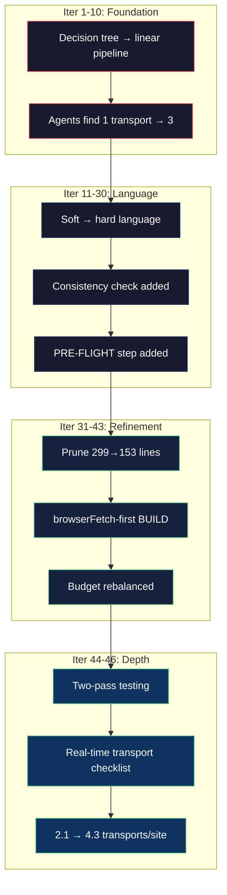
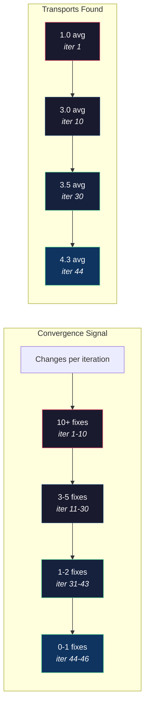

# When Do You Stop

Iteration 43. Seven out of eight agents completed the full protocol. Full elimination tables. Routes for every discovered transport. Pagination working. Session harvest successful on auth-gated endpoints. Proxy tests returning real data. The eighth agent hit a genuine edge case — a site with Kasada bot detection that blocked the browser mid-session.

Seven out of eight felt like convergence. It wasn't.

---

Iteration 44 introduced two-pass testing. Pass 1: standard breadth discovery. Pass 2: focused on transports that pass 1 missed — WebSocket, streaming, real-time feeds. The reasoning was simple: some transports only appear on specific page types. A WebSocket might only exist on a live chat page, not on product listings. Breadth-first discovery hits the obvious pages. Pass 2 sends agents to the pages where rare transports live.

The results were uncomfortable. Pass 1 averaged 2.1 transports per site. Pass 2 raised it to 4.3. The "converged" protocol was missing half the transports because it wasn't navigating to the right pages.



---

The convergence criteria I'd written were:

1. Follow the GATHER→SCAN→CLASSIFY→BUILD pipeline
2. Fill all 8 elimination rows before writing code
3. Build routes for every ✓ transport
4. Validate each route through the proxy
5. Capture browser traffic including detail page visit
6. Complete session harvest for all auth-gated endpoints
7. Complete pagination for all routes
8. Stay near 150 tool calls
9. Write all files to worktree, not main repo

Nine criteria. All measurable. Iteration 43 passed seven of eight agents on all nine. And yet the instructions were still wrong — they didn't tell agents to navigate to page types where rare transports live.

The criteria measured compliance, not coverage. An agent could follow every rule perfectly and still miss WebSocket because no rule said "go to the live chat page."

---

I added the real-time transport checklist to PRE-FLIGHT:

```
- WebSocket: [chat pages, live feeds, dashboards, notifications]
- SSE: [streaming APIs, live updates, REST with event-stream]
- HLS/DASH: [video player pages, live streams, VOD archives]
- PubSub: [event feeds, channel subscriptions]
```

If the site has real-time features, the agent MUST navigate to those pages during GATHER. Not "check for WebSocket markers in the JS bundle" — actually go to the page where WebSocket would be used.

---

So when do you stop? Not when the scorecard is green. Not when the pass rate is high. You stop when the delta between iterations shrinks below the noise — when the failures are genuine edge cases (bot detection, site outages, genuinely unusual architectures) rather than instruction gaps.

After 46 iterations, the instruction changes per iteration dropped to 1-2 minor adjustments. The transport coverage stabilized at 4+ per site. Fresh agents — clean session, no hints, no memory of previous runs — consistently followed the full protocol. The failures that remained were environmental, not instructional.



But I'm not sure the loop is done. It might never be done. Every new website is a test case, and every edge case that an agent handles wrong reveals something the instructions could say better. The question isn't "are the instructions perfect." It's "are they good enough that a fresh agent, reading them cold, makes the same decisions I would make."

Forty-six iterations in, the answer is usually yes. That's the best I've got.
